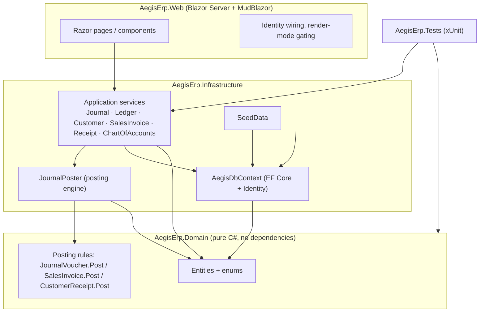
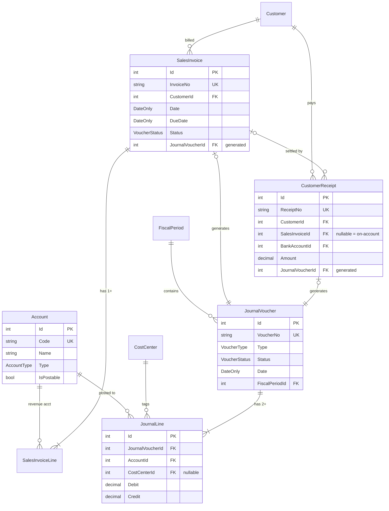
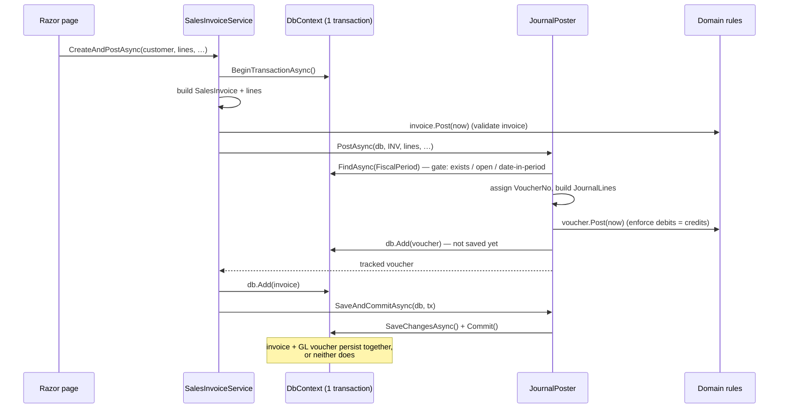
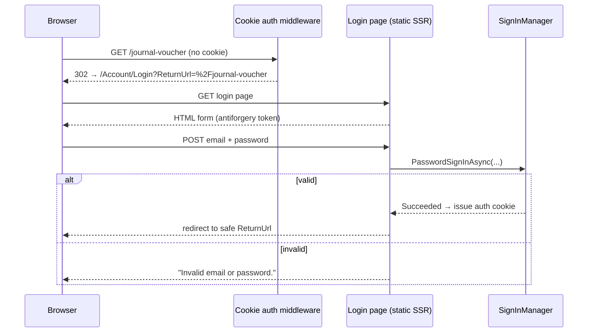
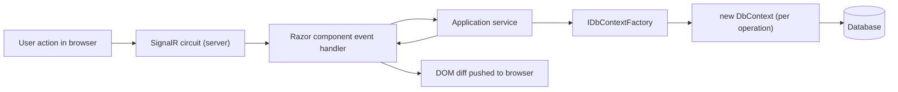
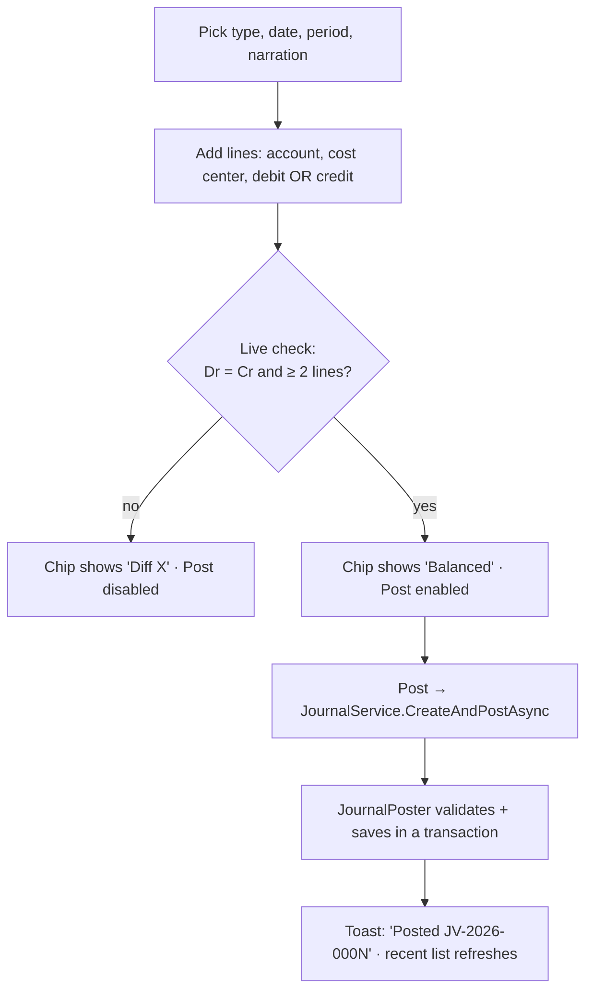
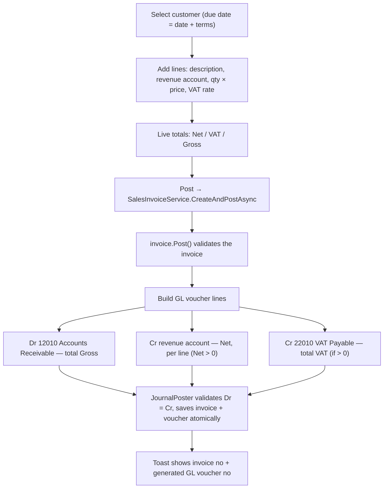
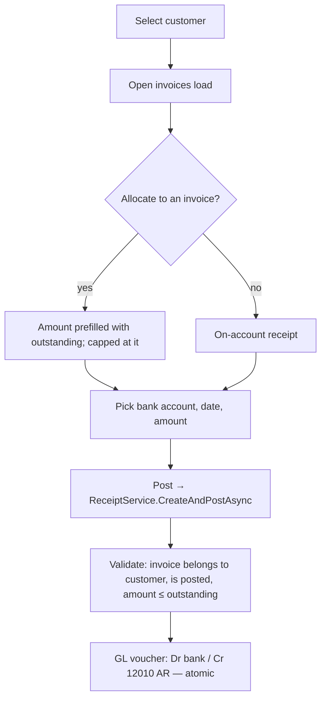
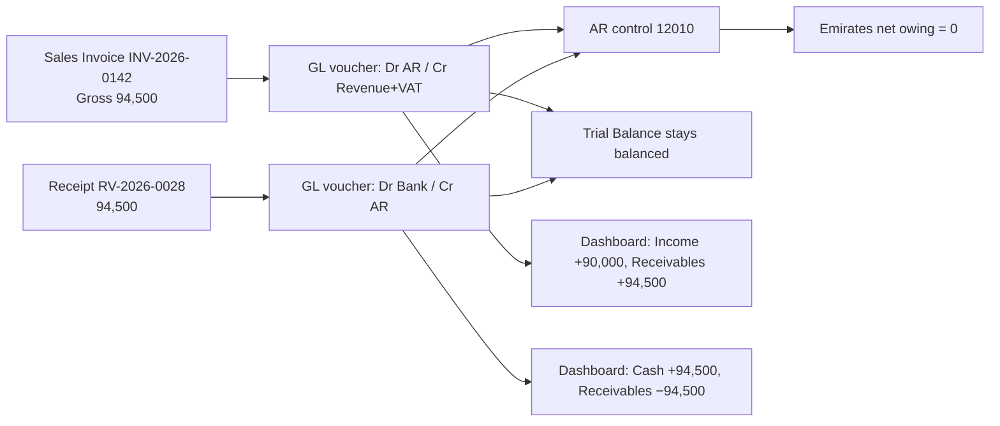

# Aegis ERP — System Flow & Architecture

> A complete walkthrough of how Aegis ERP works end to end: the architecture, the
> accounting model, the posting engine at its heart, authentication, and the full flow
> of every module built so far (General Ledger + Accounts Receivable).

**Audience:** developers joining the project and technically-literate stakeholders.
**Scope of this document:** everything currently implemented. Modules shown as
placeholders in the UI (AP, Procurement, Inventory, HR, Fixed Assets) are on the
[roadmap](#16-roadmap) and follow the same pattern described here.

Diagrams are written in Mermaid and render on GitHub, VS Code (with a Mermaid
extension), and most Markdown viewers.

---

## Table of contents

1. [What Aegis ERP is](#1-what-aegis-erp-is)
2. [Technology stack](#2-technology-stack)
3. [Architecture at a glance](#3-architecture-at-a-glance)
4. [Solution structure](#4-solution-structure)
5. [Accounting concepts you need first](#5-accounting-concepts-you-need-first)
6. [The data model](#6-the-data-model)
7. [The posting engine — the heart of the system](#7-the-posting-engine--the-heart-of-the-system)
8. [Authentication & authorization flow](#8-authentication--authorization-flow)
9. [Request lifecycle (Blazor Server)](#9-request-lifecycle-blazor-server)
10. [Module flow — General Ledger](#10-module-flow--general-ledger)
11. [Module flow — Accounts Receivable](#11-module-flow--accounts-receivable)
12. [The dashboard](#12-the-dashboard)
13. [End-to-end worked example](#13-end-to-end-worked-example)
14. [Reporting math reference](#14-reporting-math-reference)
15. [Seeded demo data](#15-seeded-demo-data)
16. [Testing, configuration & running](#16-testing-configuration--running)
17. [Known limitations & production hardening](#17-known-limitations--production-hardening)
18. [Roadmap](#18-roadmap)

---

## 1. What Aegis ERP is

Aegis ERP is a finance & operations system for a fictional UAE company, **Aegis FZE**
(currency AED, 5% VAT). It began as a single-file HTML prototype
(`aegis_erp_bc 17.05.2026.html`) styled after Microsoft Dynamics 365 Business Central,
and is being rebuilt as a real full-stack application.

What works today:

- **General Ledger** — chart of accounts, manual journal vouchers, the account ledger,
  and the trial balance.
- **Accounts Receivable** — customers, sales invoices that automatically generate their
  GL entries, customer receipts with invoice allocation, AR aging, and customer statements.
- **Security** — cookie-based login, three roles, and page-level authorization.

The defining property of the system: **every financial document becomes a balanced,
double-entry GL voucher, and the books are balanced by construction.** You cannot post
an invoice without its General Ledger entry, and you cannot post anything that doesn't
balance.

---

## 2. Technology stack

| Layer | Choice | Why |
|---|---|---|
| Runtime | .NET 8 (C#) | Strong typing, transactions, long-term maintainability for finance code |
| UI | Blazor Server + MudBlazor 7 | One language end to end; component library covers grids/dialogs/forms |
| ORM | Entity Framework Core 8 | Migrations, LINQ, provider-agnostic |
| Database | PostgreSQL (production) / SQLite (dev) | Postgres for real deployments; SQLite for zero-setup local runs |
| Auth | ASP.NET Core Identity (cookies) | Standard, battle-tested authentication and role management |
| Tests | xUnit | Fast in-memory tests over the posting engine and AR flows |

The database provider is chosen at runtime by a single config key, so the same codebase
runs on SQLite locally and PostgreSQL in production with **no code changes**.

---

## 3. Architecture at a glance

Three projects plus a test project, with dependencies pointing strictly inward. The
**Domain** knows about nothing; **Infrastructure** depends on Domain; **Web** depends on
both but only touches the database through services.



**Why it's split this way**

- **Domain** is pure C# with the accounting rules. `JournalVoucher.Post()` is where
  double-entry is enforced — it has no database or framework dependency, so it's trivially
  testable and can never be bypassed by the UI.
- **Infrastructure** owns persistence and the *application services* the UI calls. The
  `JournalPoster` static helper is the shared posting engine.
- **Web** is a thin presentation layer. Components call services; they never build SQL or
  touch `DbContext` directly for writes.

---

## 4. Solution structure

```
AegisErp.sln
├─ src/
│  ├─ AegisErp.Domain/                 # pure C# — no dependencies
│  │  ├─ Enums.cs                       # AccountType, NormalBalance, VoucherType, VoucherStatus
│  │  ├─ WellKnownAccounts.cs           # control-account codes (AR = 12010, VAT = 22010)
│  │  ├─ PostingException.cs            # thrown by all Post() methods
│  │  └─ Entities/
│  │     ├─ Account.cs  CostCenter.cs  FiscalPeriod.cs
│  │     ├─ JournalVoucher.cs  JournalLine.cs         # the GL
│  │     └─ Customer.cs  SalesInvoice.cs  CustomerReceipt.cs   # AR subledger
│  ├─ AegisErp.Infrastructure/
│  │  ├─ AegisDbContext.cs              # EF Core + ASP.NET Identity tables
│  │  ├─ DatabaseProvider.cs            # Sqlite/Postgres switch
│  │  ├─ DependencyInjection.cs         # AddAegisInfrastructure()
│  │  ├─ SeedData.cs                    # demo company + users
│  │  ├─ Identity/AppUser.cs            # user + AppRoles constants
│  │  └─ Services/
│  │     ├─ JournalPoster.cs            # THE posting engine
│  │     ├─ JournalService.cs  LedgerService.cs  ChartOfAccountsService.cs
│  │     ├─ CustomerService.cs  SalesInvoiceService.cs  ReceiptService.cs
│  │     └─ ReadModels.cs  ArReadModels.cs
│  └─ AegisErp.Web/
│     ├─ Program.cs                     # DI, auth, startup seeding
│     ├─ Identity/…AuthenticationStateProvider.cs
│     └─ Components/
│        ├─ App.razor  Routes.razor     # render-mode gating, authorized routing
│        ├─ Account/  Login·AccessDenied·AccountLayout·RedirectToLogin
│        ├─ Layout/   MainLayout·NavMenu
│        └─ Pages/    Home·ChartOfAccounts·GeneralLedger·JournalVoucher·TrialBalance·
│                     Customers·SalesInvoicePage·ReceiptVoucherPage·ArAging·UsersPage·ComingSoon
└─ tests/AegisErp.Tests/               # xUnit over an in-memory SQLite DB
```

---

## 5. Accounting concepts you need first

The whole system rests on standard double-entry bookkeeping. Five ideas:

**Chart of Accounts** — the list of accounts money is tracked in (bank, receivables,
revenue, rent…). Each `Account` has a `Code` (e.g. `12010`), a `Name`, and an
`AccountType`.

**Normal balance** — every account naturally carries its balance on one side. This is
*derived from the type*, never stored:

| AccountType | Normal balance |
|---|---|
| Asset, Expense | **Debit** |
| Liability, Equity, Income | **Credit** |

**Cost centers** — a dimension for tagging lines by business segment (Admin, Passport
Services, Travel & Tourism, HR). Answers "which part of the business earned/spent this?"

**Fiscal periods** — accounting months (e.g. "May 2026"). Every voucher posts into exactly
one period, and its date must fall inside that period.

**Vouchers & double entry** — the unit of the ledger is a **JournalVoucher**: a header plus
two or more **JournalLines**. Each line is a debit *or* a credit (never both). A voucher can
only post when **total debits = total credits**. That invariant is what keeps the books balanced.

**Subledger over the GL** — Accounts Receivable is a *subledger*. Customers, invoices, and
receipts live in their own tables, but the money always also flows through the GL control
account **12010 – Accounts Receivable**. Customer balances are computed from the AR
documents; the GL holds the accounting truth. (See the [caveat](#a-subledger-caveat).)

---

## 6. The data model



Key persistence rules (configured in `AegisDbContext.cs`):

- **Unique document numbers** — `Account.Code`, `CostCenter.Code`, `JournalVoucher.VoucherNo`,
  `SalesInvoice.InvoiceNo`, `CustomerReceipt.ReceiptNo` all have unique indexes.
- **Money precision** — all amounts are `decimal(18,2)`; `SalesInvoiceLine.Quantity` is
  `decimal(18,3)` and `VatRate` is `decimal(5,4)`.
- **Enums stored as strings** — `AccountType`, `VoucherType`, `VoucherStatus` persist as
  readable text ("Posted", "SalesInvoice") rather than integers.
- **Restrictive deletes** — accounts, periods, and customers use `DeleteBehavior.Restrict`
  so you can't delete a master record that documents reference. Voucher→lines and
  invoice→lines cascade.
- **Identity tables** — `AegisDbContext` inherits `IdentityDbContext<AppUser>`, so the
  ASP.NET Identity tables (users, roles, claims) live in the same database.

---

## 7. The posting engine — the heart of the system

Everything that touches the ledger goes through **one** place:
`JournalPoster` (`Infrastructure/Services/JournalPoster.cs`). This is what guarantees the
books stay correct no matter which module posts.

### 7.1 The atomic pattern

`JournalPoster.PostAsync(...)` builds and validates a GL voucher **on the caller's
`DbContext` and transaction, without saving or committing**. The caller owns the
transaction. This is the trick that lets a *document and its GL entry commit together*:



If **any** step throws — validation, an out-of-balance voucher, a missing control account —
the transaction is disposed without committing and nothing persists.

### 7.2 The validation rules (Domain layer)

`JournalVoucher.Post(nowUtc)` is the gatekeeper. In order, it throws a `PostingException` if:

| # | Condition | Message |
|---|---|---|
| 1 | Already `Posted` | "Voucher is already posted." |
| 2 | Was `Rejected` | "A rejected voucher cannot be posted." |
| 3 | Fewer than 2 lines | "A voucher needs at least two lines." |
| 4a | A line has no account | "Line N has no account selected." |
| 4b | A line has a negative amount | "Line N has a negative amount." |
| 4c | A line has both debit and credit | "Line N cannot be both debit and credit." |
| 4d | A line has no amount | "Line N has no amount." |
| 5 | Debits ≠ credits | "Voucher is out of balance by X (Dr … / Cr …)." |

On success it sets `Status = Posted` and `PostedAtUtc`. The GL period gate (period exists,
is not closed, and the date falls inside it) is enforced separately in `PostAsync` *before*
the voucher is built.

### 7.3 Document numbering

`NextDocNoAsync` produces `PREFIX-YEAR-####` from **the highest existing suffix + 1** (not a
naive count, so seeded/skipped numbers never collide):

| VoucherType | Prefix | Example |
|---|---|---|
| Journal | `JV` | `JV-2026-0001` |
| Receipt | `RV` | `RV-2026-0028` |
| Payment | `PV` | `PV-2026-0038` |
| SalesInvoice | `INV` | `INV-2026-0142` |
| PurchaseInvoice | `PINV` | — |
| Opening | `OB` | `OB-2026-0001` |

A sales invoice and its generated GL voucher **share the same number** (the invoice
`INV-2026-0142` produces voucher `INV-2026-0142`), so you can always trace one to the other.

### 7.4 Concurrency safety net

`SaveAndCommitAsync` wraps the save/commit and translates a unique-constraint violation
(two users computing the same document number at the same instant) into a friendly,
recoverable `PostingException` — instead of a raw `DbUpdateException` that would crash the
Blazor circuit. This makes the *losing* writer fail cleanly; the full race prevention
(row/advisory locks) is a [production-hardening item](#17-known-limitations--production-hardening).

---

## 8. Authentication & authorization flow

Auth is cookie-based ASP.NET Core Identity. There are three roles:

| Role | Can do |
|---|---|
| **Admin** | Everything, including Users & Roles. Also a poster. |
| **Accountant** | Post documents (journals, invoices, receipts) and read everything. |
| **Viewer** | Read-only: dashboards, ledgers, reports, customers. |

`AppRoles.Posters` is the constant `"Admin,Accountant"` used to gate posting pages.

### 8.1 Login sequence



Details that matter:

- **The login page renders as static server HTML, not an interactive circuit.** `App.razor`
  inspects the request path: anything under `/Account` gets render mode `null` (static SSR)
  so the sign-in form does a real HTTP POST through the cookie middleware; everything else
  runs `InteractiveServer`. This avoids the chicken-and-egg problem of signing in over a
  SignalR circuit.
- **Open-redirect protection** — `SafeReturnUrl` only honors local paths (rejects anything
  containing `://` or starting with `//`), so a crafted `ReturnUrl` can't bounce you to
  another site.
- **Logout is a POST** (`/Account/Logout`) with an antiforgery token, so it can't be
  triggered by a GET/prefetch.
- **Security-stamp revalidation** — a custom `AuthenticationStateProvider` re-checks the
  user's security stamp every 30 minutes, so a long-lived circuit is signed out if the user
  is disabled or their roles/password change.

### 8.2 Page-permission matrix

Enforced by `[Authorize]` attributes on each page, and mirrored in the UI (posting buttons
are hidden from Viewers).

| Page | Route | Required |
|---|---|---|
| Dashboard | `/` | any signed-in user |
| Chart of Accounts | `/chart-of-accounts` | any signed-in user |
| General Ledger | `/general-ledger` | any signed-in user |
| Trial Balance | `/trial-balance` | any signed-in user |
| Customers | `/customers` | any (create: posters) |
| AR Aging | `/ar-aging` | any signed-in user |
| **Journal Voucher** | `/journal-voucher` | **Posters** (Admin/Accountant) |
| **Sales Invoice** | `/sales-invoice` | **Posters** |
| **Receipt Voucher** | `/receipt-voucher` | **Posters** |
| **Users & Roles** | `/users` | **Admin** |
| Placeholders | `/soon/{module}` | any signed-in user |

If an unauthenticated user hits a protected page they are redirected to login; if a
signed-in user lacks the role they get `/Account/AccessDenied`.

---

## 9. Request lifecycle (Blazor Server)

Aegis runs as **Blazor Server**: the UI lives on the server and talks to the browser over a
SignalR "circuit". A user click is an event on the server; the server re-renders and pushes a
DOM diff back.

Because a circuit is long-lived and shared state is dangerous, data access uses
`IDbContextFactory<AegisDbContext>` — every service call spins up a **short-lived
`DbContext`**, does its work, and disposes it. This avoids the classic "one DbContext across
concurrent renders" bug.



On startup (`Program.cs`), the app creates the database if missing
(`EnsureCreated`) and seeds roles, users, and the demo company before serving traffic.

---

## 10. Module flow — General Ledger

### 10.1 Chart of Accounts (`/chart-of-accounts`)
Lists accounts by code with type and normal balance. Posters can add an account (code, name,
type, postable flag); the service trims input, rejects blanks, and rejects duplicate codes.

### 10.2 Journal Voucher (`/journal-voucher`, posters only)
The manual double-entry screen — for entries with no source document (accruals, opening
balances, payroll, corrections).



The page recomputes totals on every keystroke; the **Post** button is disabled until the
voucher balances. The date drives the period automatically. Server-side, the same rules run
again — the UI can't bypass them.

### 10.3 General Ledger (`/general-ledger`)
Pick an account + period to see opening balance, every posted line with a **running balance**,
and the closing balance. Balances are shown in the account's *normal direction*: a positive
normalized balance prints as **Dr** for asset/expense accounts and **Cr** for
liability/equity/income accounts.

### 10.4 Trial Balance (`/trial-balance`)
Every account with a non-zero balance as of the selected period end, split into Debit and
Credit columns, with totals that must be equal. The green "In balance" banner is computed
from the actual sums — it's live proof the ledger is internally consistent.

---

## 11. Module flow — Accounts Receivable

### 11.1 Customers (`/customers`)
Master list with each customer's **invoiced / received / outstanding** totals (from posted AR
documents). Clicking a row opens their **statement** — invoices (debits) and receipts
(credits) in date order with a running balance. Posters can add customers (auto-numbered
`C-0001`, `C-0002`, …).

### 11.2 Sales Invoice (`/sales-invoice`, posters only)
The flagship AR flow: posting an invoice **automatically generates its balanced GL voucher.**



**The generated entry** for an invoice with net 90,000 + 5% VAT:

| Account | Debit | Credit |
|---|---:|---:|
| 12010 Accounts Receivable | 94,500.00 | |
| 41020 Travel & Tourism Revenue | | 90,000.00 |
| 22010 VAT Payable | | 4,500.00 |

Money math uses away-from-zero rounding: each line's `Net = round(qty × price, 2)`,
`Vat = round(Net × rate, 2)`, `Gross = Net + Vat`. Zero-net lines (e.g. complimentary items)
stay on the invoice but are omitted from the GL voucher so it still balances.

### 11.3 Receipt Voucher (`/receipt-voucher`, posters only)
Records money received and generates **Dr bank / Cr Accounts Receivable**. A receipt can be
**allocated to a specific invoice** (the amount is capped at that invoice's outstanding
balance) or left **on account**.



### 11.4 AR Aging (`/ar-aging`)
For an as-of date, each open invoice's outstanding (gross − allocated receipts) is bucketed by
**days past its due date**:

| Bucket | Days past due |
|---|---|
| Current | not yet due (≤ 0) |
| 1–30 | 1–30 |
| 31–60 | 31–60 |
| 61–90 | 61–90 |
| 90+ | over 90 |

On-account receipts appear as **unallocated credits** and reduce the customer's total due.

<a id="a-subledger-caveat"></a>
> **Subledger caveat.** Customer subledger totals reflect *posted AR documents only*. The GL
> opening balance sitting on account 12010 (from the opening-balance voucher) is not
> attributed to any customer, so the sum of customer outstandings can differ from the GL AR
> control-account balance until historical invoices are entered. This is expected for a fresh
> subledger and is called out in the UI.

---

## 12. The dashboard

The home page (`/`) shows six KPI tiles for the current period, computed live from posted
lines:

| Tile | How it's computed |
|---|---|
| Income (period) | −(sum of Income-account movements in the period) |
| Expenses (period) | sum of Expense-account movements in the period |
| Net Profit | Income − Expenses |
| Cash & Bank | balance of accounts whose code starts `110`, cumulative to period end |
| Receivables | balance of account `12010`, cumulative to period end |
| Payables | balance of account `21010`, cumulative to period end |

Income and payables are sign-flipped because those accounts are credit-normal, so the tiles
read as positive, intuitive numbers.

---

## 13. End-to-end worked example

Follow one sale from quote to cash, using data actually seeded in the app. **Bill Emirates
Group for a travel package, then collect payment.**

**Step 1 — Post the sales invoice** `INV-2026-0142` (5 May 2026): 1 × 90,000 @ 5% VAT for
Emirates Group (Travel & Tourism segment). The system generates GL voucher
`INV-2026-0142`:

| Account | Debit | Credit |
|---|---:|---:|
| 12010 Accounts Receivable | 94,500.00 | |
| 41020 Travel & Tourism Revenue | | 90,000.00 |
| 22010 VAT Payable | | 4,500.00 |

Effects: Emirates now owes **94,500**; revenue and VAT are recognized. The trial balance
still balances (Dr 94,500 = Cr 94,500).

**Step 2 — Post the receipt** `RV-2026-0028` (8 May 2026): Emirates pays 94,500 into the ENBD
bank account, allocated to `INV-2026-0142`. Generated GL voucher `RV-2026-0028`:

| Account | Debit | Credit |
|---|---:|---:|
| 11020 ENBD Current Account | 94,500.00 | |
| 12010 Accounts Receivable | | 94,500.00 |

**Step 3 — See it flow through the system:**



Net result: cash up 94,500, receivable cleared, revenue 90,000 and VAT 4,500 recognized,
Emirates' statement shows a zero balance, and the invoice drops off AR aging. Every one of
those views is derived from the two balanced GL vouchers — **nothing is updated by hand.**

---

## 14. Reporting math reference

All reports derive from one projection: every `JournalLine` whose voucher `Status == Posted`,
materialized into memory before any decimal arithmetic (SQLite can't aggregate `decimal`
server-side, so the code sums in C# — and this runs identically on PostgreSQL).

| Report | Formula |
|---|---|
| **Account ledger** | `sign = +1` if account is debit-normal else `−1`. Opening `= sign × Σ(Dr − Cr)` before the period; each row `running += sign × (Dr − Cr)`. |
| **Trial balance** | Per account, `net = Σ(Dr − Cr)` up to period end. `net > 0` → Debit column; `net < 0` → Credit column (absolute). Totals must match. |
| **Aging** | Per open invoice: `outstanding = Gross − Σ(allocated receipts)`, bucketed by `asOf − DueDate` in days. |
| **Customer statement** | Invoices as debits, receipts as credits, ordered by date, with a running balance. |

---

## 15. Seeded demo data

On first run the database is seeded with a complete, balanced demo company so every screen has
realistic data.

**Roles & demo accounts**

| Email | Password | Roles |
|---|---|---|
| owner@aegiserp.com | Aegis#Owner2026 | Admin, Accountant |
| accounts@aegiserp.com | Aegis#Finance2026 | Accountant |
| readonly@aegiserp.com | Aegis#View2026 | Viewer |

**Fiscal periods:** Apr, May, Jun, Jul 2026.
**Cost centers:** Admin, Passport Services, Travel & Tourism, HR.
**Customers:** C-0001 Emirates Group (30-day terms), C-0002 Spice Jet Ltd (30), C-0003 DNATA
Travel (45).

**Chart of accounts**

| Code | Name | Type |
|---|---|---|
| 11020 | ENBD Current Account | Asset |
| 11030 | Mashreq Bank Account | Asset |
| 12010 | Accounts Receivable | Asset |
| 13010 | Prepaid Expenses & VAT Input | Asset |
| 15010 | Fixed Assets | Asset |
| 21010 | Accounts Payable | Liability |
| 22010 | VAT Payable | Liability |
| 31010 | Share Capital & Retained Earnings | Equity |
| 41010 | Passport Services Revenue | Income |
| 41020 | Travel & Tourism Revenue | Income |
| 51010 | Salaries & Wages | Expense |
| 51020 | Office Rent | Expense |

**Seeded documents:** an opening-balance voucher (`OB-2026-0001`, equity balancing to
5,203,707), office rent and payroll payments, four sales invoices (`INV-2026-0141..0144`), and
two customer receipts (`RV-2026-0028`, `RV-2026-0029`) — all posted through the same engine, so
the seeded trial balance is in balance.

---

## 16. Testing, configuration & running

**Run:**
```bash
dotnet run --project src/AegisErp.Web
```
First launch creates `aegis_erp.db` (SQLite) and seeds everything. Sign in with a demo account.

**Test:**
```bash
dotnet test
```
17 xUnit tests cover the posting rules (balanced/unbalanced/single-line/wrong-period vouchers),
the invoice → GL voucher construction and VAT handling, receipt allocation and over-allocation
rejection, aging buckets, the customer statement, and a full invoice+receipt cycle staying in
balance. Tests run against an in-memory SQLite database seeded per test.

**Switch to PostgreSQL** — edit `src/AegisErp.Web/appsettings.json`; no code change:
```json
"Database": { "Provider": "Postgres" },
"ConnectionStrings": {
  "Postgres": "Host=localhost;Database=aegis_erp;Username=postgres;Password=…"
}
```

---

## 17. Known limitations & production hardening

Deliberately deferred; none affect single-user SQLite dev, and the full fixes are
PostgreSQL-specific.

- **Schema management** — the app uses `EnsureCreated()`, so schema changes require deleting the
  dev database. Switch to EF Core migrations before production (`dotnet-ef` is already pinned).
- **Concurrent document numbering** — `NextDocNoAsync` is "max + 1" with no lock. The losing
  writer now fails cleanly (unique index + friendly error) rather than crashing, but the proper
  fix is a per-(prefix, year) advisory lock or a Serializable transaction with retry.
- **Concurrent receipt allocation** — the outstanding-balance check isn't backed by a DB
  constraint, so two simultaneous receipts on the same invoice could over-settle it on Postgres.
  Fix: lock the invoice row (`FOR UPDATE`) or persist an `AllocatedTotal` with a check constraint.
- **Period close** — `FiscalPeriod.IsClosed` exists and `JournalPoster` refuses to post into a
  closed period, but there is no UI yet to close a period.

---

## 18. Roadmap

The same Domain → Service → Blazor pattern extends to the rest of the modules:

1. **Accounts Payable** — Vendors, Purchase Invoice, Payment Voucher (a mirror of AR).
2. **Credit/debit notes** and multi-invoice receipt allocation.
3. **Approval workflows** — the prototype's Initiator → Finance → CFO → Posted chains.
4. **Period close** and the financial statements (P&L, Balance Sheet, Cash Flow) off the ledger.
5. **Inventory, HR/Payroll (WPS), Fixed Assets** with automated depreciation.
6. **Production hardening** — migrations, concurrency locks, HTTPS/hosting, backups, a real
   user-management UI.

---

*This document describes the system as implemented. When behavior changes, update this file
alongside the code.*
